<h1 align="center">BioSave - Dokumentasi Flora & Fauna</h1>

## 🌿 Tentang BioSave
**BioSave** adalah platform digital yang berfungsi sebagai katalog dan pusat dokumentasi flora dan fauna yang hidup di kawasan hutan lindung. Platform ini hadir untuk mengumpulkan, mengelola, dan menyajikan informasi keanekaragaman hayati secara terstruktur, akurat, dan mudah diakses oleh masyarakat.

**Visi:** Menjadi platform digital edukatif dan terpercaya dalam mendukung pelestarian keanekaragaman hayati hutan lindung melalui dokumentasi dan partisipasi masyarakat.

---

## 👥 Hak Akses (Roles)
Aplikasi ini memiliki tiga hak akses utama dengan fungsi yang berbeda:
1. **Public:** Masyarakat umum yang dapat menjelajahi katalog flora dan fauna.
2. **user:** Kontributor yang memiliki akses untuk mengusulkan data flora atau fauna baru.
3. **Admin Dashboard:** Pengelola sistem yang memiliki otoritas penuh untuk validasi data, kelola anggota, dan pengaturan sistem.

---

## 📸 Dokumentasi Antarmuka (Landing Page & Dashboard)

### 1. Role: Public (Landing Page Utama)
Halaman depan yang menampilkan katalog publik dan informasi umum BioSave.

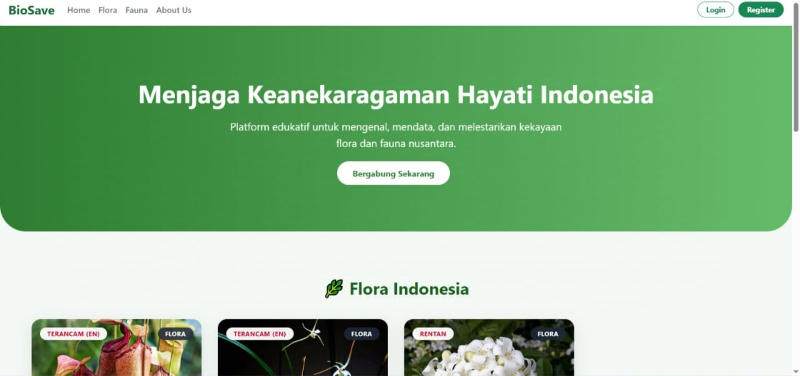

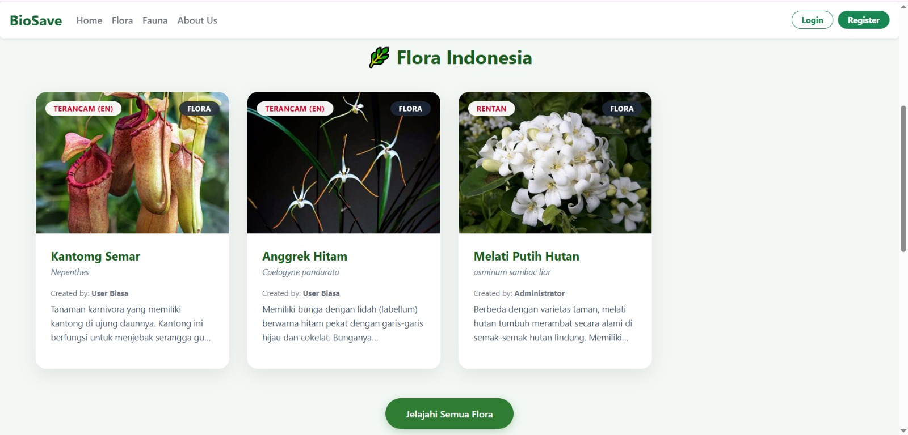

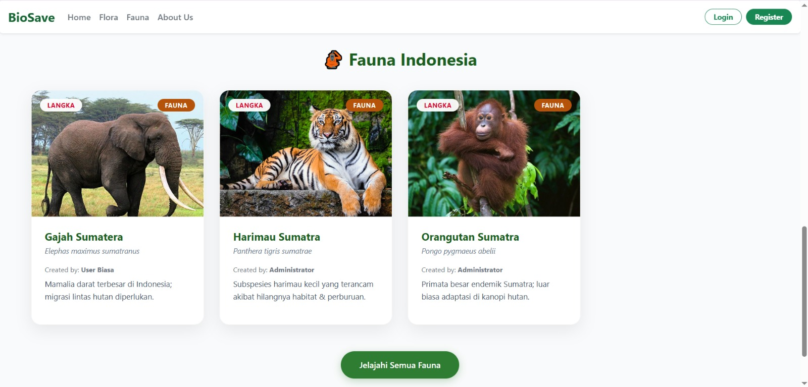

Pengunjung umum dapat menikmati fitur berikut:
* **Katalog Flora & Fauna:** Menjelajahi daftar tumbuhan dan hewan yang ada di hutan lindung secara terstruktur.

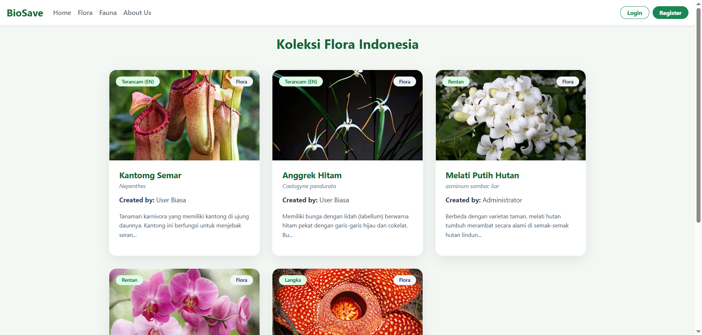

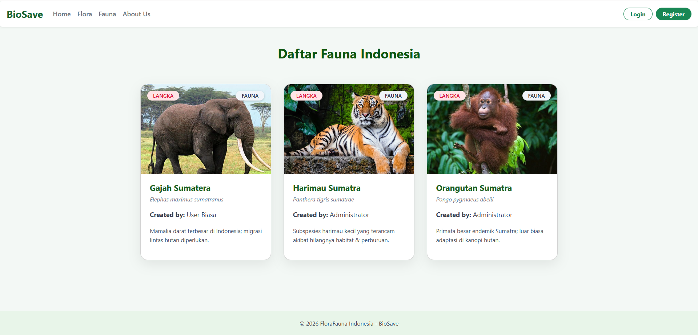

* **Detail Edukasi:** Membaca deskripsi mendalam, status konservasi, dan melihat foto asli dari setiap flora/fauna.

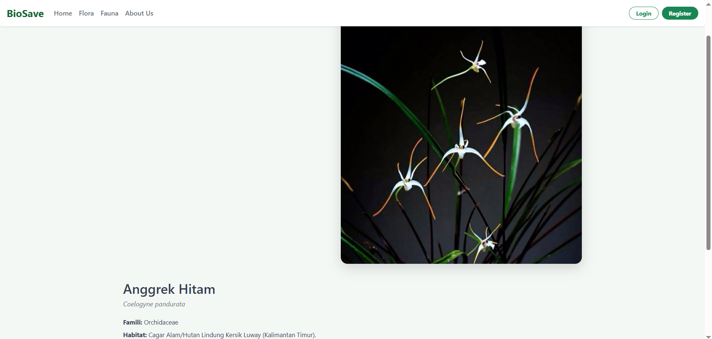

* **Informasi BioSave:** Membaca Visi, Misi, dan profil organisasi untuk mengenal lebih jauh tujuan platform ini.

### 2. Role: User
Halaman khusus bagi kontributor untuk melakukan pengajuan data flora/fauna.

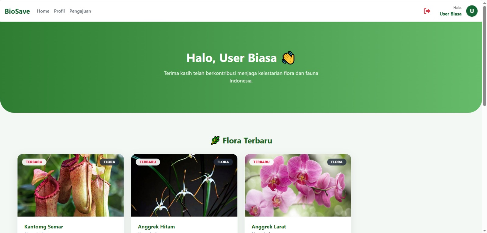

User dapat melakukan beberapa fungsi, yaitu:
* **Riwayat Pengajuan:** Melacak apakah data Anda sudah disetujui (Approved) atau masih ditinjau (Pending).

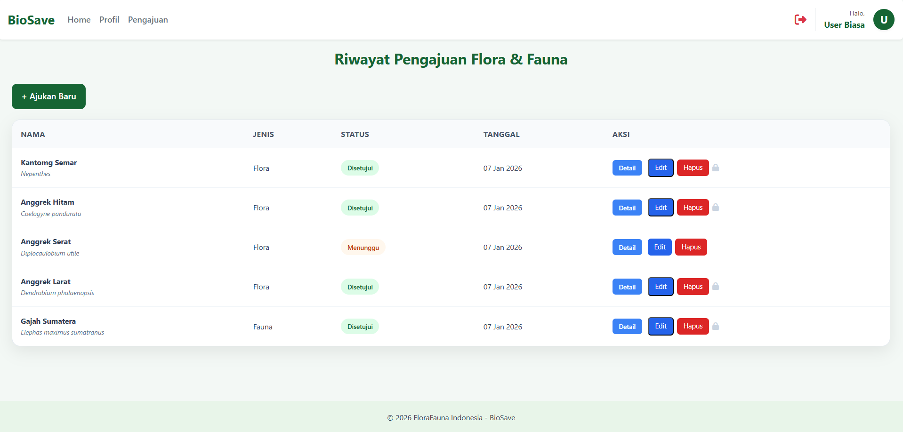

* **Edit Profil:** Memperbarui informasi biodata kontributor.

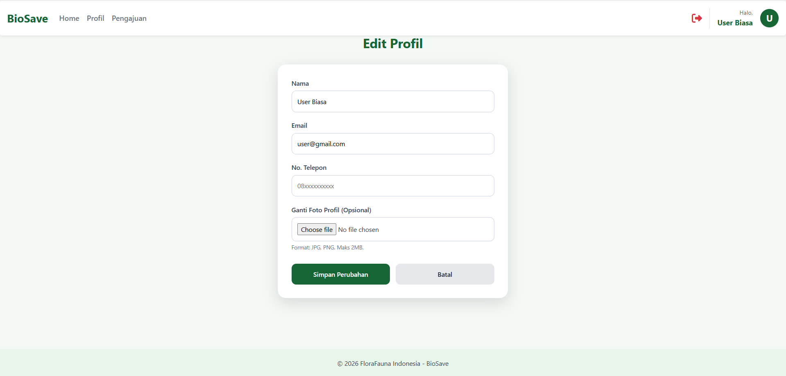

### 3. Role: Admin (Dashboard)
Panel kendali utama untuk manajemen konten dan user.

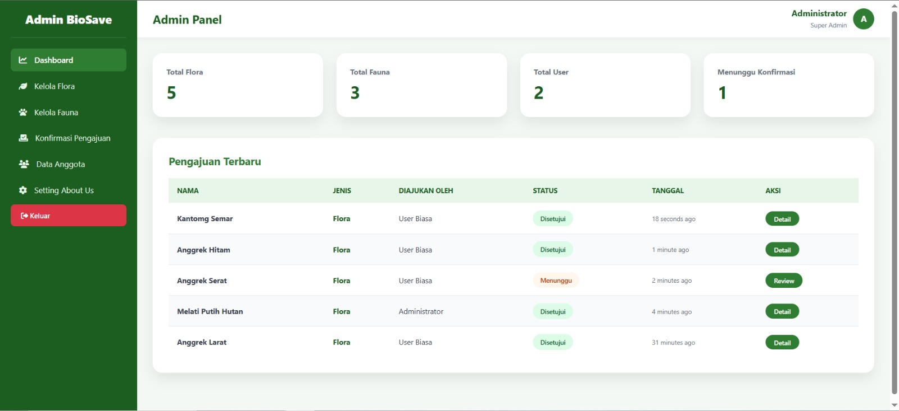

Admin dapat melakukan beberapa fungsi, yaitu:
* **Kelola Flora & Fauna:** Menambah, mengubah, atau menghapus data spesies.

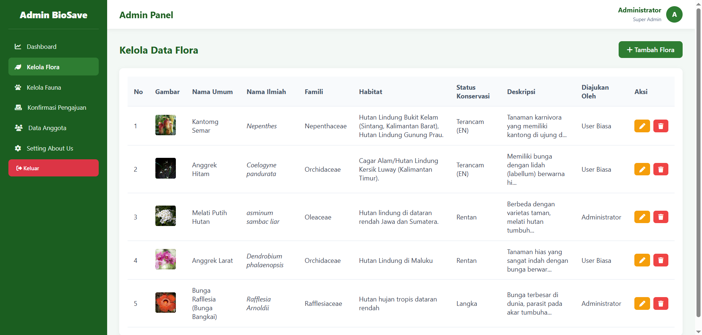

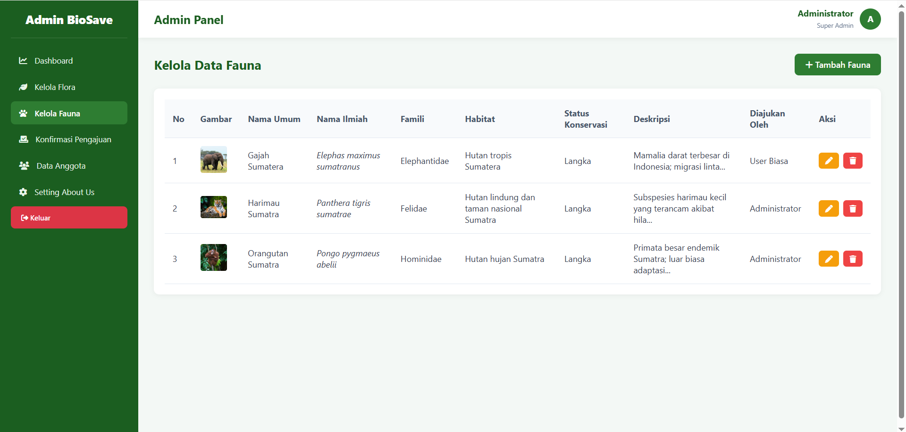

* **Konfirmasi Pengajuan:** Memvalidasi data yang dikirimkan oleh role Publik.

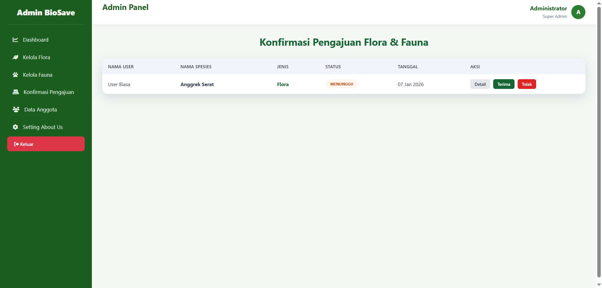

* **Data Anggota:** Mengatur akun pengguna yang terdaftar di sistem.

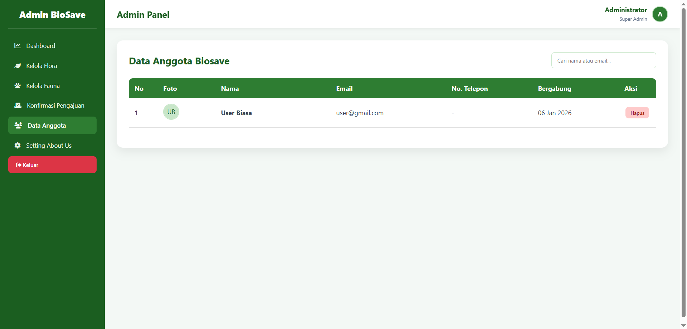

* **Setting About Us:** Mengubah informasi Visi, Misi, dan Deskripsi platform.

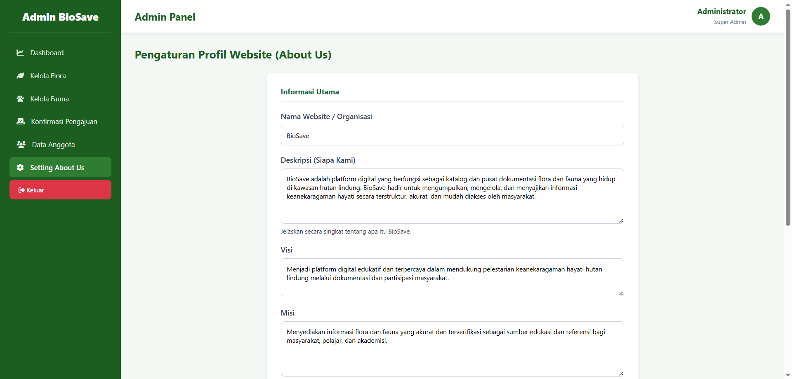

---

---

## 🛠️ Teknologi yang Digunakan
* **Framework:** [Laravel](https://laravel.com)
* **Database:** MySQL

---

## 👩‍💻 Tim Pengembang
Proyek ini dikembangkan oleh:
* **Sinta Rahmati**
* **Salwa Arguyani Munda**

---

© 2026 BioSave - Menjaga Keanekaragaman Hayati

